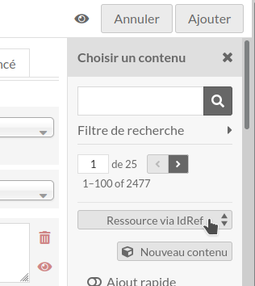

Copy IdRef (module for Omeka S)
===============================

> __New versions of this module and support for Omeka S version 3.0 and above
> are available on [GitLab], which seems to respect users and privacy better
> than previous repository.__

Voir le [lisez-moi] en français.

[Copy IdRef] is a module for [Omeka S] that allows to use the thesaurus [IdRef of Abes]
in order to create new contents from IdRef data. This is useful when we need to
create items for authors. If the author is not in Omeka, then it is possible to
search in the IdRef base, to create the record inside it if needed and if you
have an account on it, and to fetch data in a new item, and to link it with the
item currently in edition.

This module uses the [IdRef modal popup], so it's easier for the user to know
the resource is created.

If you just need to link references from IdRef for some properties, the module
[Value Suggest] should be used instead.

If items contain the uri, they may be automatically filled or updated.

Installation
------------

See general end user documentation for [installing a module].

The module [Common] must be installed first.

If custom vocabs with uris are used in a mapping, you may need module [Bulk Edit].

* From the zip

Download the last release [CopIdRef.zip] from the list of releases, and uncompress
it in the `modules` directory, and rename the directory `CopIdRef`.

* From the source and for development

If the module was installed from the source, rename the name of the folder of
the module to `CopIdRef`.

Utilisation
-----------

When creating or editing a record, click on `Omeka Resource`, search if the
resource does not already exist in your database, then, if needed, launch the
search in IdRef via the selector.

In the IdRef window, search for your record or create a new one (an account
can be requested from Abes) and click on the button "Link the record". This
record will be automatically created in Omeka and linked to the current
resource.

A default mapping between Unimarc and Omeka ontologies is present in the `data/mappings`
folder. You can modify it or complete it if needed. Only the authors and
collectivities are predefined, in addition to a generic mapping.

To update items, use the sync tool available in the module config.

TODO
----

- [ ] Modernize js (promise).
- [ ] Fill a new item (cf. module Advanced Resource Template).
- [ ] Implement the simplified mapping from the module Advanced Resource Template

Warning
-------

Use it at your own risk.

It’s always recommended to backup your files and your databases and to check
your archives regularly so you can roll back if needed.

Troubleshooting
---------------

See online issues on the [module issues] page on GitLab.

License
-------

This module is published under the [CeCILL v2.1] license, compatible with
[GNU/GPL] and approved by [FSF] and [OSI].

This software is governed by the CeCILL license under French law and abiding by
the rules of distribution of free software. You can use, modify and/ or
redistribute the software under the terms of the CeCILL license as circulated by
CEA, CNRS and INRIA at the following URL "http://www.cecill.info".

As a counterpart to the access to the source code and rights to copy, modify and
redistribute granted by the license, users are provided only with a limited
warranty and the software’s author, the holder of the economic rights, and the
successive licensors have only limited liability.

In this respect, the user’s attention is drawn to the risks associated with
loading, using, modifying and/or developing or reproducing the software by the
user in light of its specific status of free software, that may mean that it is
complicated to manipulate, and that also therefore means that it is reserved for
developers and experienced professionals having in-depth computer knowledge.
Users are therefore encouraged to load and test the software’s suitability as
regards their requirements in conditions enabling the security of their systems
and/or data to be ensured and, more generally, to use and operate it in the same
conditions as regards security.

The fact that you are presently reading this means that you have had knowledge
of the CeCILL license and that you accept its terms.

Copyright
---------

* Copyright Daniel Berthereau, 2021-2024 (see [Daniel-KM] on GitLab)
* Copyright Abes, (see files in [the presentation])

These features are built for the future digital library [Manioc] of the
Université des Antilles and Université de la Guyane, currently managed with
[Greenstone].

[Copy IdRef]: https://gitlab.com/Daniel-KM/Omeka-S-module-CopIdRef
[lisez-moi]: https://gitlab.com/Daniel-KM/Omeka-S-module-CopIdRef/blob/master/LISEZMOI.md
[Omeka S]: https://omeka.org/s
[IdRef of Abes]: https://www.idref.fr
[IdRef modal popup]: http://documentation.abes.fr/aideidrefdeveloppeur/index.html#installation
[Value Suggest]: https://github.com/omeka-s-modules/ValueSuggest
[Installing a module]: https://omeka.org/s/docs/user-manual/modules/#installing-modules
[Common]: https://gitlab.com/Daniel-KM/Omeka-S-module-Common
[CopIdRef.zip]: https://gitlab.com/Daniel-KM/Omeka-S-module-CopIdRef/-/releases
[Bulk Edit]: https://gitlab.com/Daniel-KM/Omeka-S-module-BulkEdit
[modules issues]: https://gitlab.com/Daniel-KM/Omeka-S-module-CopIdRef/-/issues
[CeCILL v2.1]: https://www.cecill.info/licences/Licence_CeCILL_V2.1-en.html
[GNU/GPL]: https://www.gnu.org/licenses/gpl-3.0.html
[FSF]: https://www.fsf.org
[OSI]: http://opensource.org
[MIT]: http://opensource.org/licenses/MIT
[the presentation]: http://documentation.abes.fr/aideidrefdeveloppeur/index.html
[Manioc]: http://www.manioc.org
[Greenstone]: http://www.greenstone.org
[GitLab]: https://gitlab.com/Daniel-KM
[Daniel-KM]: https://gitlab.com/Daniel-KM "Daniel Berthereau"
