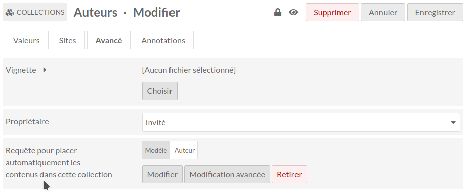

Collections dynamiques (module pour Omeka S)
============================================

> __Les nouvelles versions de ce modules et l’assistance pour Omeka S version 3.0
> et supérieur sont disponibles sur [GitLab], qui semble mieux respecter les
> utilisateurs et la vie privée que le précédent entrepôt.__

See [English readme].

[Collections dynamiques] est un module pour [Omeka S] qui permet d’attacher
automatiquement des contenus aux collections via une requête standard.

Par exemple, il est possible de créer une collection rassemblant tous les
contenus de couleur bleu ou tous les contenus de type Audio ou tous les contenus
du 14e siècle, ou tout autre requête adaptée à vos collections.

Installation
------------

Consulter la documentation utilisateur pour [installer un module].

Ce module utilise le module [Common], qui doit être installé en premier.

* À partir du zip

Télécharger la dernière livraison [DynamicItemSets.zip] depuis la liste des
livraisons et décompresser le dans le dossier `modules`.

* Depuis la source et pour le développement

Si le module est installé depuis la source, renommez le nom du dossier du module
en `DynamicItemSets`.

Utilisation
-----------

Pour rendre une collection dynamique, il suffit de définir la requête qui va
en définir les contenus via le champ dans l’onglet Avancé de l’édition d’une
collection.

En indiquant une requête dans l’onglet Avancé du formulaire de collection,
tous les contenus existants et les nouveaux seront automatiquement placés dans
cette collection conformément à la requête.

Attention : les contenus placés manuellement dans la collection seront
automatiquement détachés s’ils ne se trouvent pas dans les résultats de la
requête.

Il n’y a pas de différence entre les collections dynamiques et les autres. Il
est recommandé d’utiliser un modèle de ressource spécifique ou d’ajouter une
propriété avec un booléen (module [Data Type Rdf]) pour les utiliser plus
facilement.

Il est possible de les identifier via la recherche avancée avec le bouton radio
"Est dynamique" ou en ajoutant `is_dynamic=1` dans l’url (https://example.org/admin/item-set?is_dynamic=1)
ou de les exclure avec `is_dynamic=0`.

TODO
----

- [ ] Ajouter la colonne dans la navigation des collections.

Avertissement
-------------

À utiliser à vos propres risques.

Il est toujours recommandé de sauvegarder vos fichiers et vos bases de données
et de vérifier vos archives régulièrement afin de pouvoir les reconstituer si
nécessaire.

Dépannage
---------

Voir les problèmes en ligne sur la page des [questions du module] du GitLab.

Licence
-------

Ce module est publié sous la licence [CeCILL v2.1], compatible avec [GNU/GPL] et
approuvée par la [FSF] et l’[OSI].

Ce logiciel est régi par la licence CeCILL de droit français et respecte les
règles de distribution des logiciels libres. Vous pouvez utiliser, modifier
et/ou redistribuer le logiciel selon les termes de la licence CeCILL telle que
diffusée par le CEA, le CNRS et l’INRIA à l’URL suivante "http://www.cecill.info".

En contrepartie de l’accès au code source et des droits de copie, de
modification et de redistribution accordée par la licence, les utilisateurs ne
bénéficient que d’une garantie limitée et l’auteur du logiciel, le détenteur des
droits patrimoniaux, et les concédants successifs n’ont qu’une responsabilité
limitée.

À cet égard, l’attention de l’utilisateur est attirée sur les risques liés au
chargement, à l’utilisation, à la modification et/ou au développement ou à la
reproduction du logiciel par l’utilisateur compte tenu de son statut spécifique
de logiciel libre, qui peut signifier qu’il est compliqué à manipuler, et qui
signifie donc aussi qu’il est réservé aux développeurs et aux professionnels
expérimentés ayant des connaissances informatiques approfondies. Les
utilisateurs sont donc encouragés à charger et à tester l’adéquation du logiciel
à leurs besoins dans des conditions permettant d’assurer la sécurité de leurs
systèmes et/ou de leurs données et, plus généralement, à l’utiliser et à
l’exploiter dans les mêmes conditions en matière de sécurité.

Le fait que vous lisez actuellement ce document signifie que vous avez pris
connaissance de la licence CeCILL et que vous en acceptez les termes.

Copyright
---------

* Copyright Daniel Berthereau, 2023-2025 (voir [Daniel-KM] sur GitLab)

Cette fonctionnalité était initialement présente dans le module [Modèle de ressources avancé]
avant d’en être extraite pour en faire un module indépendant pour le site des
[collections de la Maison de Salins].

[Collections dynamiques]: https://gitlab.com/Daniel-KM/Omeka-S-module-AdvancedResourceTemplate
[English readme]: https://gitlab.com/Daniel-KM/Omeka-S-module-DynamicItemSets/-/blob/master/README.md
[Omeka S]: https://omeka.org/s
[installer un module]: https://omeka.org/s/docs/user-manual/modules/#installing-modules
[Common]: https://gitlab.com/Daniel-KM/Omeka-S-module-Common
[Data Type Rdf]: https://gitlab.com/Daniel-KM/Omeka-S-module-DataTypeRdf
[DynamicItemSets.zip]: https://gitlab.com/Daniel-KM/Omeka-S-module-DynamicItemSets/-/releases
[Data Type Rdf]: https://gitlab.com/Daniel-KM/Omeka-S-module-DataTypeRdf/-/releases
[questions du module]: https://gitlab.com/Daniel-KM/Omeka-S-module-DynamicItemSets/-/issues
[CeCILL v2.1]: https://www.cecill.info/licences/Licence_CeCILL_V2.1-en.html
[GNU/GPL]: https://www.gnu.org/licenses/gpl-3.0.html
[FSF]: https://www.fsf.org
[OSI]: http://opensource.org
[MIT]: http://opensource.org/licenses/MIT
[Modèle de ressources avancé]: https://gitlab.com/Daniel-KM/Omeka-S-module-AdvancedResourceTemplate/-/blob/master/LISEZMOI.md
[collections de la Maison de Salins]: https://collections.maison-salins.fr/
[GitLab]: https://gitlab.com/Daniel-KM
[Daniel-KM]: https://gitlab.com/Daniel-KM "Daniel Berthereau"
